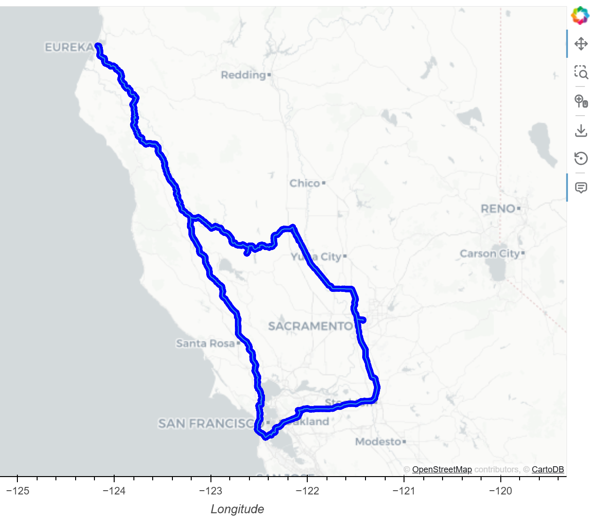

# Weather Destination Finder

This project features a pipeline that builds a global weather dataset, filters destinations by temperature preference, finds nearby hotels, and generates a multi-stop driving itinerary, all visualized on interactive maps. 

## Process

The pipeline runs through four stages in a single notebook:

**1. Build the Weather Database** - Samples 2,000 random coordinates across the globe, maps each to its nearest city using `citipy`, then pulls current weather data (temperature, humidity, wind, cloud cover, description) from the [OpenWeatherMap API](https://openweathermap.org/api). Requests are batched with rate-limit handling to avoid API throttling. 

Results are cached to CSV so subsequent runs skip the fetch entirely.

**2. Filter by Temperature** - Prompts for a preferred temperature range and narrows the dataset to matching cities. Can be changed in the future per stakeholder consultation.

**3. Hotel Search** - For each candidate city, the [Geoapify Places API](https://www.geoapify.com/) searches for hotels within a 5 km radius. Results are displayed on an interactive HvPlot map where point size reflects temperature.

**4. Driving Itinerary** - Emulating four cities are selected by end-user for a round-trip route, the [Geoapify Routing API](https://apidocs.geoapify.com/docs/routing/) returns the full route geometry, which is overlaid on the map using GeoViews.

## Tools/Libraries

| Category | Tools |
|----------|-------|
| Language | Python |
| Data Wrangling | Pandas, NumPy |
| APIs | OpenWeatherMap, Geoapify (Places + Routing) |
| Geo-visualization | HvPlot, GeoViews |
| Geocoding | citipy |

## Setup

Create a `config.py` file in the project root with your API keys:
```python
weather_api_key = "YOUR_OPENWEATHERMAP_KEY"
geoapify_key = "YOUR_GEOAPIFY_KEY"
```
> **Note:** `config.py` is included in `.gitignore` to prevent key exposure.

## Project Structure

```
Weather_Database/
  WeatherPy_Database.csv       # auto-generated on first run
weather_destination_finder.ipynb
config.py                      # (not tracked - add your own keys)
README.md
```

## Example Output



The sample itinerary routes through four cities California:

**El Granada > Laguna > Clearlake > Fortuna > El Granada**
